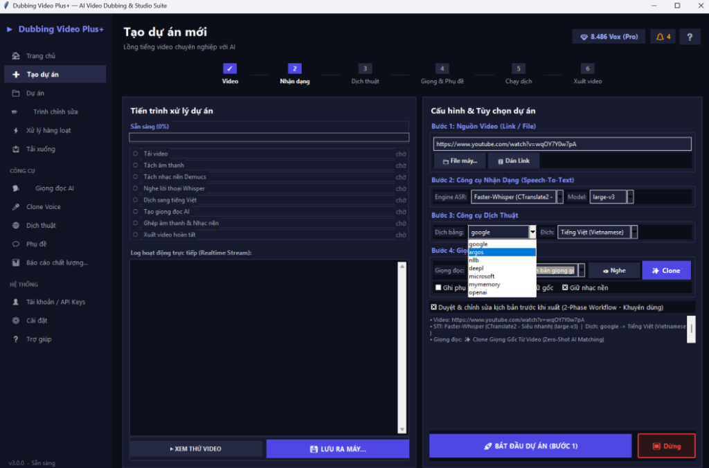

# 🎬 Dubbing Video Plus+ — AI Video Dubbing & Studio Suite

<div align="center">



[](https://www.python.org/)
[](https://developer.nvidia.com/cuda-zone)
[](https://pytorch.org/)
[](https://www.microsoft.com/windows)
[](LICENSE)

*An end-to-end desktop studio for automated AI video dubbing, multi-speaker character voice cloning, high-speed neural speech synthesis, and studio-grade background music preservation.*

</div>

---

## 🌟 Key Features

- **🚀 Hardware-Accelerated AI Pipeline (NVIDIA CUDA):**
  - Instant speech-to-text recognition with **Faster-Whisper (CTranslate2 float16)**.
  - Studio-grade vocal & background music stem separation powered by **Demucs AI**.
  - 5x–10x faster rendering speed on modern NVIDIA RTX & GTX GPUs.

- **🌐 Multi-Engine Fast Translation:**
  - Fast, reliable online translation with **Google Translate** and **DeepL API**.
  - Fully offline, private neural translation with **Meta NLLB-200** (200+ languages) and **Argos Translate**.
  - Optional local/remote LLM support (Ollama, LM Studio, OpenAI-compatible APIs).

- **🎭 Character-Specific Voice Cloning (Zero-Shot AI):**
  - Automatically extracts character reference audio directly from video dialogue.
  - Supports multi-speaker diarization to preserve distinct character voices.
  - In-app microphone recording suite to build custom voice clone profiles.

- **🎙️ Ultra-Natural Neural Text-to-Speech (TTS):**
  - 120+ natural neural voices across Vietnamese (North/Central/South dialects), English, Japanese, Chinese, and Korean.
  - Dynamic tempo stretching and duration fitting (`atempo` / `rubberband`) to match speaker lip-sync.

- **🛠️ Interactive 2-Phase Script Editor (Workbench):**
  - Live timeline segment review and sentence-by-sentence audio playback.
  - Assign specific voices and volume gains per dialogue line.
  - Burn hardcoded subtitles with custom fonts, colors, and background masking.

- **🧹 Clean & Modular Workspace Management:**
  - Automated project directory organization in `workspace/`.
  - Bulk project selection, batch deletion, and disk space cleaner.

---

## 🏗️ System Architecture

```
[ Video Input (File / YouTube / TikTok) ]
                   │
                   ▼
       [ Demucs Audio Separation ]
        ├── Instrumental Music Bed
        └── Clean Isolated Vocals
                   │
                   ▼
      [ Faster-Whisper ASR (CUDA) ] ───► [ Transcript JSON + Timestamps ]
                   │
                   ▼
   [ Fast Direct Translation Engine ] ──► [ Translated Transcript ]
                   │
                   ▼
 [ Voice Clone / Neural TTS Synthesis ] ──► [ Segmented Audio Clips ]
                   │
                   ▼
    [ Audio Stitching & Lip-Sync Fit ]
                   │
                   ▼
[ Video & Audio Muxing + Subtitle Burn ] ──► [ Final Dubbed Video (MP4) ]
```

---

## ⚡ Quick Start & Installation

### 1. Prerequisites
- **OS:** Windows 10 / Windows 11 (64-bit)
- **Python:** Python 3.10, 3.11, or 3.12
- **GPU (Recommended):** NVIDIA GPU with CUDA 12.x support (RTX / GTX series)
- **FFmpeg:** Installed and available in system `PATH` (or placed in project directory).

### 2. Clone the Repository
```bash
git clone https://github.com/your-username/dubbing-video-plus.git
cd dubbing-video-plus
```

### 3. Create a Virtual Environment & Install Dependencies
```powershell
# Create virtual environment
python -m venv venv
.\venv\Scripts\activate

# Install PyTorch with CUDA acceleration (for NVIDIA GPUs):
pip install torch torchaudio --index-url https://download.pytorch.org/whl/cu124

# Install application requirements:
pip install -r requirements.txt
```

### 4. Launch the Application
```powershell
python main.py
```

---

## 📖 How to Use

1. **Step 1: Input Video**
   - Paste a video link (YouTube, TikTok, Douyin, Bilibili) or browse a local video file from your computer.
2. **Step 2: Speech Recognition & Translation**
   - Select ASR Model (e.g. `large-v3` or `medium` for optimal accuracy).
   - Select Target Language (e.g. `Tiếng Việt`) and Translation Engine (default: `Google Translate`).
3. **Step 3: Voice Selection**
   - Choose a neural voice preset or enable **`✨ Clone Video`** to automatically clone original character voices.
4. **Step 4: Interactive Review (Phase 1)**
   - Click **`BẮT ĐẦU DỰ ÁN (BƯỚC 1)`**. The system will download, separate audio, transcribe, and translate.
   - The interactive **Editor Workbench** opens automatically, allowing you to fine-tune text, adjust timing, and preview voice synthesis.
5. **Step 5: Render & Export (Phase 2)**
   - Click **`🎬 XUẤT VIDEO HOÀN TẤT`** to generate the final synchronized dubbed video.

---

## 📁 Project Structure

```
dubbing_video_plus/
├── config.py             # Global application configuration & path resolution
├── main.py               # Application entry point
├── requirements.txt      # Python package dependencies
├── README.md             # Project documentation
├── .gitignore            # Git ignore definitions
├── core/
│   ├── dub_engine.py       # 2-Phase dubbing pipeline orchestrator
│   ├── batch_processor.py  # Multi-video queue processor
│   ├── model_loader.py     # CUDA hardware & model detection
│   └── settings_manager.py # Persistent user settings & API keys
├── services/
│   ├── asr_service.py         # Faster-Whisper ASR transcription
│   ├── audio_separator.py     # Demucs audio separation
│   ├── translation_service.py # Direct multi-engine translation
│   ├── tts_service.py         # Neural TTS & tempo synchronization
│   ├── voice_catalog.py       # Voice presets catalog
│   ├── voice_clone_manager.py # Speaker cloning & profile manager
│   ├── video_muxer.py         # FFmpeg video/audio mixing & muxing
│   ├── subtitle_export.py     # SRT/VTT export & ASS burning
│   └── youtube_downloader.py  # yt-dlp multi-platform downloader
├── ui/
│   ├── app_window.py      # Tkinter modern desktop GUI
│   └── styles.py          # Dark theme design system & widgets
└── workspace/             # Working directory (cache, outputs, downloads)
```

---

## 🤝 Contributing

Contributions, issues, and feature requests are welcome! Feel free to check the [issues page](https://github.com/your-username/dubbing-video-plus/issues).

---

## 📄 License

This project is licensed under the MIT License - see the [LICENSE](LICENSE) file for details.
